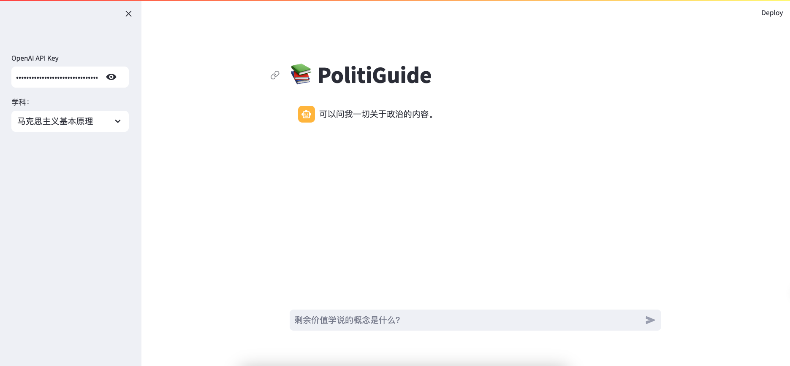
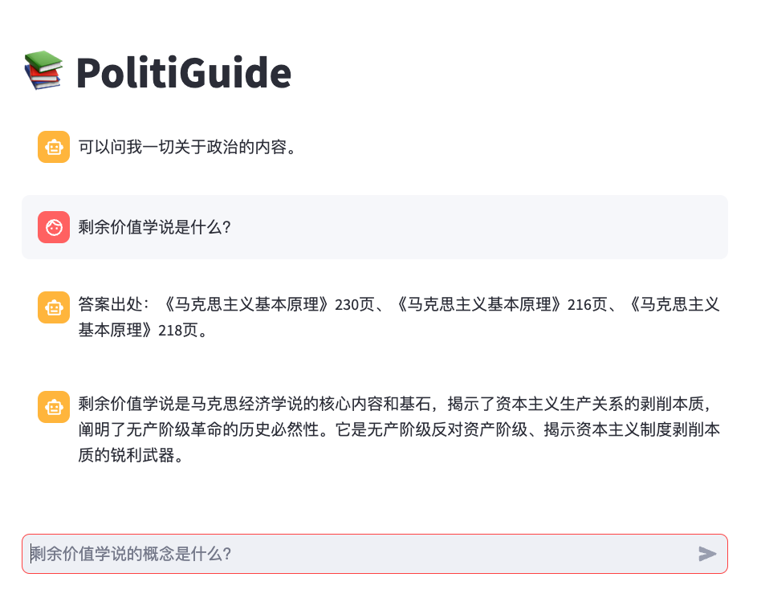

# 📚PoliticGuide

💻[code](https://github.com/ustbChengzhao/Langchain_Tutorial/blob/main/chat_demo/PolitiGuide.py)

基于langchain的RAG应用，覆盖考研政治的知识点，根据问题回答并给出答案出处。





### 用法

```shell
conda create -nn politicguide python==3.11
pip install -r requirements.txt
streamlit run PoliticGuide.py
```

